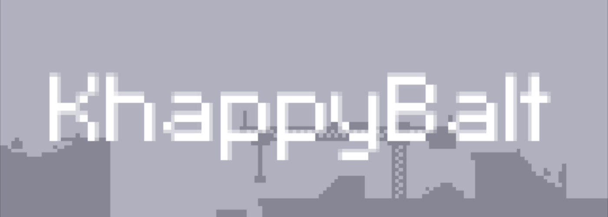

# Let's Kode: KhappyBalt

**KhappyBalt** is a [Kha](http://kha.tech) iteration of [Adam 'Atomic' Saltsmans](http://adamatomic.com) [FlappyBalt](http://adamatomic.com/flappybalt), plus [HaxeFlixel](http://haxeflixel.com) has a [FlappyBalt](http://haxeflixel.com/demos/Flappybalt) demo, which uses a [Haxe](https://haxe.org) version of Adams flixel framework

Built along in the Let's Kode: KhappyBalt game tutorial series, with full source code available on the [GitHub](https://github.com/lewislepton/letskodekhappybalt) repository.

In the series we create **KhappyBalt** from start to finish using [Kha](http://kha.tech) & the [Raccoon Engine](https://lewislepton.com/code/raccoon) that we have been building in the [Kha Tutorial Series](https://lewislepton.com/learn/khatutorialseries)

We build upon the original & add in extra features & utilise a lot from the [Raccoon Engine](https://lewislepton.com/code/raccoon) including but not limited to:

• Menu & Retry States 
• Audio: sound effects & music 
• Sprite flipping 
• Buttons 
• plus many more lovely features

The game is built with simplicity in mind, but leaving a good amount of space for us to go back into the code & make it much better.

Have phün & happy coding

[**Lewis Lepton**](https://lewislepton.com)